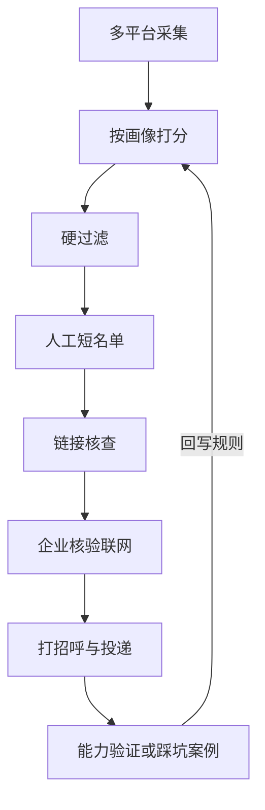

# 找实习兼职与防诈骗助手

面向远程实习 / 兼职场景的**可配置筛选流水线**：多平台采集 → 按画像打分 → 硬过滤 → 人工短名单 → 链接核查 → **联网企业核验（防诈骗）**。

这不是某个人的求职日记，而是一套可复用的工具与规则框架。你把自己的能力画像写进配置，把踩坑经验沉淀进案例库，规则就会越用越准。

本 README 是**唯一的使用说明入口**；各子目录的 README 只讲"这个目录是什么"，不重复用法，用法都在这一份里。

## 目录（本文档）

- [解决什么问题](#解决什么问题)
- [运行环境 / 能用哪些软件](#运行环境--能用哪些软件)
- [快速开始](#快速开始)
- [运行示例（真实输出）](#运行示例真实输出)
- [换一个爬取方向给别人用](#换一个爬取方向给别人用)
- [流水线与命令详解](#流水线与命令详解)
- [企业核验维度](#企业核验维度)
- [防骗自查](#防骗自查投递前-10-秒)
- [能力验证与踩坑闭环](#能力验证与踩坑闭环)
- [运行测试](#运行测试)
- [仓库目录一览](#仓库目录一览)
- [依赖与许可](#依赖与许可)

## 解决什么问题

远程兼职信息鱼龙混杂。常见风险不只是「公司查不到」，还包括：

1. **发薪/合同主体与招聘展示主体不一致**
2. **任务内容与公司主营业务明显错配**（例如环保科技公司却安排整理电商商品链接）
3. **刷单 / 点击任务 / 整理商品链接**等灰产前置信任任务（先给小额真实报酬再诱导升级）
4. 付费实习、培训贷、职介内推收费等

脱敏踩坑样板（手法与规则；不含真实主体名与转账截图）：[`踩坑案例库/案例/2026-07-18_运营助理岗位诈骗信号案例.md`](踩坑案例库/案例/2026-07-18_运营助理岗位诈骗信号案例.md)

## 运行环境 / 能用哪些软件

本质上是一套**普通的 Python 命令行脚本 + JSON 配置**，不绑定任何特定编辑器或 AI 工具。

| 环境 | 能不能用 | 说明 |
|---|---|---|
| 系统终端（PowerShell / cmd / bash） | ✅ 主用法 | 只要装了 Python 就能跑全部脚本，这是唯一必需环境 |
| VS Code / Cursor / Windsurf 等编辑器 | ✅ | 用来改 JSON 配置、看 md 报告、在集成终端里跑命令，纯属方便 |
| Cursor Agent / Codex / 其他 AI 编程助手 | ✅ 可选辅助 | 可以让它帮你改配置、跑命令、写打招呼话术；**流水线本身不依赖任何 AI 助手运行** |
| 纯网页聊天（不能执行本机命令的 AI） | ❌ | 能帮你讨论思路，但没法跑本地脚本、读写本地文件 |
| 手机 | 基本不现实 | 采集、批次目录都是按本机文件系统设计的 |

换句话说：**换台电脑、换个编辑器、甚至不用任何 AI 工具，只要装了 Python，都能照样跑。** 你在 Cursor 里做只是因为顺手，不是必须。

## 快速开始

在仓库根目录打开终端：

```powershell
# 1. 复制画像模板并填写你自己的信息（该文件已被 .gitignore，不会进仓库/不会被覆盖）
Copy-Item 配置\画像.example.json 配置\画像.json

# 2.（可选）企业核验：复制 .env.example 为 .env，填入你自己的 API Key
Copy-Item .env.example .env
# ARK_API_KEY=你的火山引擎方舟密钥
# ARK_MODEL=doubao-seed-2-0-lite-260215

# 3. 新建批次并跑流水线
python 工具/新建批次.py --批号 2026-07-18-01
python 工具/采集_实习僧.py --批号 2026-07-18-01
python 工具/打分.py --批号 2026-07-18-01
python 工具/过滤.py --批号 2026-07-18-01
python 工具/分平台导出.py --批号 2026-07-18-01
python 工具/核查链接.py --批号 2026-07-18-01

# 4. 联网企业核验（需要 ARK_API_KEY）
python 工具/企业核验.py --公司 "公司名|渠道|岗位|异常线索（如有）"
```

跑完之后，去 `日期/<批号>/平台结果/<平台>/可投递.md` 看结果；产出长什么样可以先看 [`示例批次/`](示例批次/) 里的占位符样例。

Boss 不扫搜索页：把职位详情 URL 手动粘贴到本批 `日期/<批号>/Boss待抓链接.txt`，再运行 `采集_Boss.py`。

## 运行示例（真实输出）

下面是拿 [`示例批次/过程归档/原始采集/01_原始_示例.jsonl`](示例批次/过程归档/原始采集/01_原始_示例.jsonl)（3 条占位符数据，含一条高危运营助理样例）当作某平台采集结果，跑通 `打分 → 过滤 → 分平台导出` 三步之后的**真实终端输出**（非手写模拟）：

```text
> python 工具/打分.py --批号 2026-07-18-01
[打分] 读取 01_原始_实习僧样例.jsonl: 3
[打分] wrote 3 → 日期/2026-07-18-01/02_已打分.jsonl

> python 工具/过滤.py --批号 2026-07-18-01
[过滤] 输入 3
[过滤] 硬过滤剔除 0；同公司同类去重 0；保留 3
[过滤] 短名单为空，已初建 ← 过滤结果（3）
[过滤] wrote 03_已过滤.jsonl + 03_人工浏览.md

> python 工具/分平台导出.py --批号 2026-07-18-01
[分平台] 实习僧: 2
[分平台] Boss: 1
[分平台] 拉勾: 0
[分平台] 共导出 3 条 → 日期/2026-07-18-01/平台结果
```

生成的 `平台结果/实习僧/可投递.md` 片段：

```markdown
## 优先投递（≥40）（1）

### 1. [产品助理](https://example.com/job/demo-product-assistant)
- 公司：示例智能硬件公司｜城市：深圳｜行业：未标注｜学历：未标注
- 薪资：面议｜匹配分：64｜远程：明确远程

## 可尝试（15–39）（1）

### 1. [运营助理](https://example.com/job/demo-ops-assistant)
- 公司：示例招聘展示公司｜城市：远程｜行业：未标注｜学历：未标注
- 薪资：80-150元/天｜匹配分：39｜远程：明确远程
```

可以看到光靠关键词打分，这条运营助理并不会被自动剔除（分数够进"可尝试"），这正是为什么还需要下一步的[企业核验](#企业核验维度)——手法说明见[踩坑案例库](踩坑案例库/案例/2026-07-18_运营助理岗位诈骗信号案例.md)。

## 换一个爬取方向给别人用

给别的求职方向的人用，**不用改代码，只改三个配置**：

| 目的 | 改哪个文件 | 改什么 |
|---|---|---|
| 搜什么关键词（爬取方向） | [`配置/数据源.json`](配置/数据源.json) | `shixiseng.searches` 里的 `keyword` / `pages`；`lagou.search_urls` |
| 怎么打分（谁的简历） | 你本地的 `配置/画像.json`（从 `画像.example.json` 复制出来） | `keywords.high/mid/low`、`education`、`score_weights` |
| 绝对不投什么 | [`配置/过滤规则.json`](配置/过滤规则.json) | `hard_exclude`（学历/专业/内容硬排除）；`risk_flags` 一般不用改，对所有人通用 |

以「想投前端远程实习」为例：

1. **数据源**：把 `数据源.json` 里的检索词换成 `前端 远程`、`React 远程`、`Vue 远程` 等，删掉/减少不相关的词（比如「知识库」「Excel」）。
2. **画像**：把 `keywords.high` 换成 `前端`、`React`、`Vue`、`TypeScript`；`low` 里放不想要的方向。
3. **Boss**：仍然要自己手动去 Boss 搜、贴链接到 `Boss待抓链接.txt`（工具设计上不扫 Boss 搜索页，避免账号风险）。
4. `配置/过滤规则.json` 的诈骗红线（发薪主体不一致、刷单类关键词等）**保持不变**，对任何求职方向都适用。

改完直接重跑「快速开始」里的流水线命令即可，不需要碰 `工具/*.py`。

## 流水线与命令详解



| 步骤 | 命令 | 产出 |
|---|---|---|
| 新建批次 | `工具/新建批次.py --批号 <批号>` | `日期/<批号>/` 目录骨架 |
| 采集 | `工具/采集_实习僧.py`、`采集_Boss.py`、`采集_拉勾.py` | `01_原始_*.jsonl` |
| 打分 | `工具/打分.py` | `02_已打分.jsonl` |
| 过滤 | `工具/过滤.py` | `03_已过滤.jsonl` + `03_人工浏览.md` |
| 分平台导出 | `工具/分平台导出.py` | `平台结果/<平台>/可投递.md` |
| 链接核查 | `工具/核查链接.py` | 更新短名单，剔除明确下线的岗位 |
| 企业核验 | `工具/企业核验.py` | 联网核验结果（真实性/发薪主体一致性/业务错配） |

所有脚本都支持 `--批号 YYYY-MM-DD-NN`（别名 `--run`）；当天只有一个批次时可省略。

> `工具/岗位卡片.py` 不是一个独立命令，是 `分平台导出.py`（以及可选的 `渲染岗位卡片.py`）共用的岗位卡片渲染函数库，不需要单独运行。`工具/渲染岗位卡片.py` 是可选脚本：当你想用「旧版风格」（含谨慎分组、画像摘要）重新渲染某批次已导出的 `平台结果/<平台>/可投递.jsonl` 时才用得上，日常流水线跑 `分平台导出.py` 就够了：
>
> ```powershell
> python 工具/渲染岗位卡片.py --批号 <批号>
> ```

## 企业核验维度

[`工具/企业核验.py`](工具/企业核验.py) 调用火山引擎豆包 Responses API + `web_search`，输出字段包括：

- 可信度（高/中/低/高危）
- 主营业务一句话
- **发薪主体一致性**（一致/不一致/未知）
- **业务与任务是否匹配**（匹配/错配/未知）
- 风险点与建议（可投/慎投/排除）

判断维度来自真实踩坑后提炼的规则，不是凭空设计；公开仓只保留手法描述。规则出处见 [`配置/过滤规则.json`](配置/过滤规则.json) 的 `risk_flags` 与 [`踩坑案例库/`](踩坑案例库/)。

## 防骗自查（投递前 10 秒）

- 是否要求缴费 / 押金 / 购买设备？→ 终止
- 发薪或合同主体是否与招聘展示名一致？→ 不一致则高危
- 任务是否像整理商品链接 / 刷单 / 点击任务？→ 高危或慎投
- 官方邮箱域名是否与公司官网一致？

## 能力验证与踩坑闭环

- 笔试/面试通过 → 写入画像的 `validated_job_types`（方法论见 [`能力验证方法论.md`](能力验证方法论.md)）
- 踩坑 → 写入 [`踩坑案例库/`](踩坑案例库/)，并把新信号提炼进过滤规则/核验 prompt

## 运行测试

核心打分/过滤逻辑（`工具/打分.py::score_job`、`工具/过滤.py::hard_exclude` 等）有 `tests/` 下的 pytest 用例覆盖，不依赖你本地的 `画像.json`（用测试内置的最小画像/规则字典）：

```powershell
pip install -r requirements-dev.txt
pytest tests -q
```

## 仓库目录一览

| 路径 | 说明 |
|---|---|
| `工具/` | 采集、打分、过滤、合并、核查、企业核验、新建批次 |
| `配置/` | `画像.example.json`、`数据源.json`、`过滤规则.json` |
| `tests/` | 打分/过滤核心逻辑的 pytest 用例，见[运行测试](#运行测试) |
| `示例批次/` | 用占位符重建的产出样例（演示形态，非真实投递记录），详见其 README |
| `踩坑案例库/` | 已验证的高危手法与证据附件，详见其 README |
| `能力验证方法论.md` | 笔试/面试结果如何反向提高同类岗位权重 |
| `项目演进记录/` | 从旧版单脚本到现版流水线的历史证据，详见其 README |
| `日期/` | 本地真实批次（由脚本创建，默认不进仓库） |

## 依赖与许可

- Python 3.10+ 推荐；运行依赖见 [`requirements.txt`](requirements.txt)（`requests`），开发/测试依赖见 [`requirements-dev.txt`](requirements-dev.txt)（额外含 `pytest`）
- 企业核验需要火山引擎方舟 API Key（可选，见 `.env.example`）
- Windows 下请以 UTF-8 读写；脚本路径基于 `__file__`，建议在仓库根目录执行命令
- 许可：MIT，见 [`LICENSE`](LICENSE)（版权栏用的是项目名而非个人真实姓名，若你要挂到自己的 GitHub 账号下，可自行改成你的名字/GitHub ID）
