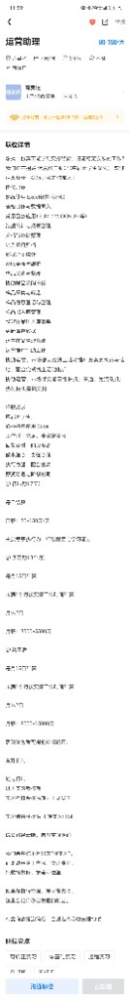
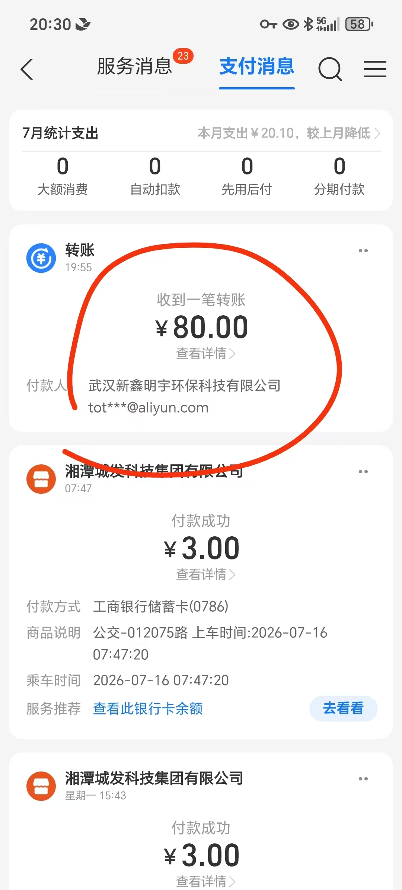

# 茹美达 · 运营助理（诈骗/灰产信号案例样板）

## 基本信息

- 渠道：实习僧｜标注薪资 80–150 元/天
- 发现日期：2026-07-18（投递并实际做了约 2 天后发现异常）

## 证据附件（案例样板）

后续新案例可照此结构在同级 `附件/` 目录放截图，并在正文引用。

### 1. 岗位详情

招聘页显示「运营助理」，实际任务描述大量涉及**整理京东商品链接**等低门槛计件内容：

### 2. 发薪截图（招聘主体 ≠ 发薪主体）

收款记录显示付款方为 **武汉新鑫明宇环保科技有限公司**，金额 ¥80，与招聘展示的「茹美达」不是同一主体：

## 异常是怎么发现的

1. 实际工作内容是**整理京东商品链接**，与岗位名「运营助理」的常规工作内容不太对得上。
2. 收款截图显示：付款方为 **武汉新鑫明宇环保科技有限公司**，转账 ¥80（对应约 2 天工作量，明显低于岗位标注的 80–150 元/天下限）。
3. 招聘信息里展示的公司主体，与实际打款主体**不是同一个名字**。
4. 将情况交给联网核验后判断：**可能是诈骗；即使不是诈骗也属于灰产**，对想用实习经历充实简历的学生风险很高。

## 联网核验结论（交叉验证）

用本仓库 [`工具/企业核验.py`](../../工具/企业核验.py) 复核（联网检索来源含企查查等公开信息）：

> 茹美达｜**高危**｜发薪主体武汉新鑫明宇环保科技有限公司主营业务为**环保设备、环保材料技术开发及相关产品批发零售、建筑工程施工**｜发薪主体一致性：**不一致**｜业务与任务：**错配**｜风险点：发薪主体与招聘主体名称不一致；整理商品链接属诈骗/灰产常见前置信任任务；发薪主体主营业务与任务内容明显不符｜建议：**排除**

## 提炼出的新型异常信号

1. **发薪/合同主体与招聘展示主体不一致** —— 比「企业信息不透明」更强的红线。
2. **业务与任务内容明显错配** —— 一家「环保科技」公司安排「整理电商商品链接」。
3. **「整理商品链接 / 刷单 / 点击任务」类内容本身是高风险关键词** —— 哪怕先给了真实小额报酬（本例 ¥80），也不能当作靠谱证据；常见套路是用小额真实转账建立信任，再诱导垫付或升级任务。
4. **到手报酬低于标注区间** —— 标注 80–150 元/天，2 天只到手 ¥80，结算规则不透明。

以上已写入 [`配置/过滤规则.json`](../../配置/过滤规则.json) 的 `risk_flags`，并由企业核验 prompt 使用。

## 建议处理方式

- 立即停止继续投入时间。
- 不要在简历上写成正式「实习经历」；若需说明，只客观写「投递后发现企业信息与实际用工主体不一致，主动终止」。
- 警惕后续「升级任务」「需要垫付」「解冻资金」等话术 —— 一律终止，不要转账。
- 若对方索要身份证/银行卡等敏感信息，或已造成资金损失，保留聊天与转账记录，必要时通过 12315 或当地网警平台举报。

## 对本工具的价值

本案例展示了完整闭环：

> 规则/核验提示词可识别主体不一致与业务错配 → 真实踩坑反向验证 → 把新信号固化进过滤规则与核验脚本 → 后续批次自动拦截同类风险。
